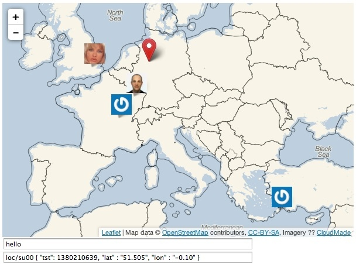

Work in Progress!



These things work:

* Load friends from users.json
* Obtain friends' icon from Gravatar
* move a friend when (s)he moves
* move self (red Icon)
* pan to bound all icons
* label popup with name, loc if name in users.json

## users.json

```json
{
    "loc/jpm" : {
	    "name": "JP",
	    "mail": "jpmens@gmail.com"
    },
    "loc/su00" : {
    	"name": "Suze Smith",
	"mail": "su@example.net"
    }
}
```

## TODO

* add name, location, (reverse geo) to marker
* <del>can mouse-hover over marker show popup instead of having to click?</del> Done
* keep map positioned where it is w/o re-scale (easier see of moving markers)
* add activity counter right of map to show new friends' PUBs


## Credits

* [Leaflet.js](http://leafletjs.com).
* [jshash](http://pajhome.org.uk/crypt/md5/index.html) by Paul Johnston. (BSD)
* [jQuery](http://jquery.com/)

